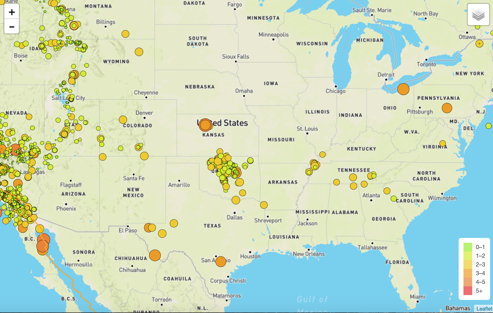
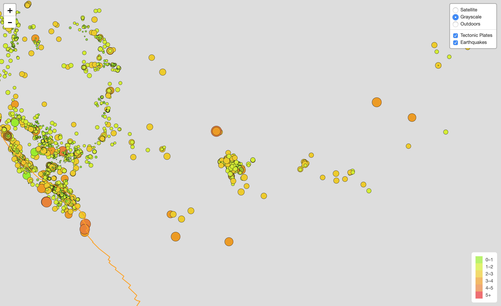

# Visualizing-Data-with-Leaflet-Project

## This project was developed by Radha Mahalingam on 6-19-19

In this project, I have attempted to do the visualization of earthquakes occurring globally using a live API feed provided by the USGS(United States Geological Survey). The data in the feed is updated every 5 mins, and includes all earthquake data for the Past 7 Days. I have also included an additional layer of tectonic plates to understand the relationship between tectonic plates and seismic activites.

#### Technology stack used in developing this web application is as follows:
* leaflet.js
* HTML/CSS/Bootstrap/Javascript
* GeoJSON

#### Data Sources used :
* https://earthquake.usgs.gov/earthquakes/feed/v1.0/geojson.php
* https://raw.githubusercontent.com/fraxen/tectonicplates/master/GeoJSON/PB2002_boundaries.json

#### Images from the app

